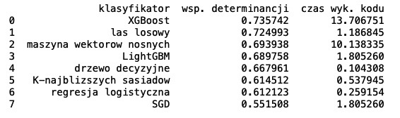
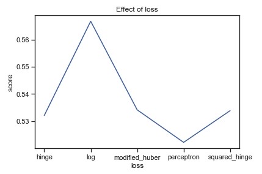
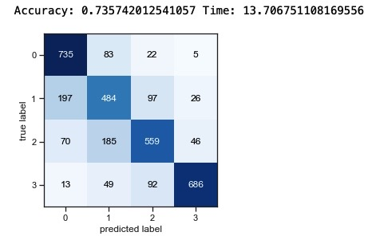

# Multiklasyfikacja

## Dane
Plik z danymi zawiera informacje o roznych cechach klientow silowni. Kazda osoba jest sklasyfikowana do jednej z czterech kategorii zdrowia.
Liczba zmiennych objasniajacyh: 11, zmienne ilosciowe i kategoryczne. Zmienna objasniajaca: kategoryczna - 4 klasy.
Dane zostaly pobrane z serwisu kaggle.com

## Informacje
Celem projektu jest przetestowanie roznych metod klasyfikacji i wybranie optymalnego klasyfikatora w stosunku do dolaczonych danych,
ktory z najwyzsza skutecznoscia bedzie przewidywal kategorie zdrowia osoby, na podstawie jego cech. Pod uwage bedzie wzieta zarowno
skutecznosc klasyfikacji, jak i szybkosc implementacji.
Kod napisany w 2022 r. w języku Python 3.

## Pliki
- bodyPerformance.csv - plik z danymi
- klasyfikacja.py - kod

## Przykladowe rezultaty dzialania programu

